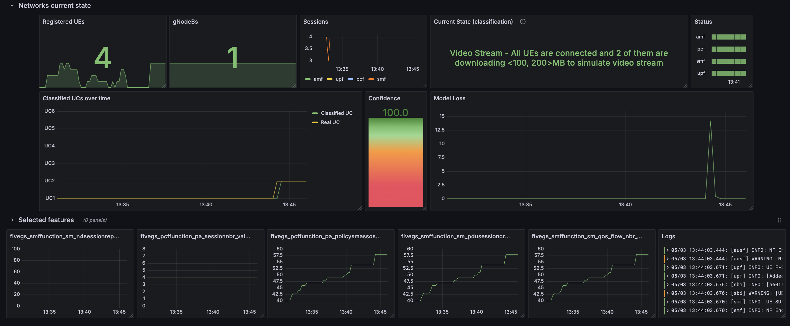

# Research in the field of Digital Twin technology
Bachelor's thesis, Faculty of informatics and information technologies

## Author: David Truhlar, Supervisor: Ing. Matej Petrik

### Digital Twin (Core + UERANSIM + Grafana, Loki and custom  metrics + LSTM real-time classification with online fine-tunning)

#### Platform compatibility
This project was tested on:
- macOS Sequoya Version 15.4 with Docker Desktop v4.40.0
- Ubuntu 22.04.3 LTS (Jammy Jellyfish) with Docker v28.0.1
- Windows 11 Home with WSL2 (Ubuntu 22.04.3 LTS) with Docker Desktop v4.40.0

#### Prerequisites
- git (version 2.39.5)
- docker (version 28.0.1)

#### Step 1: Clone repository
```bash
git clone https://github.com/xtruhlar/5GDigitalTwin.git
cd 5GDigitalTwin/Implementation 
```

#### Step 2: Build Docker images
```bash
cd ./open5gs/base
docker build -t docker_open5gs .

cd ../ueransim
docker build -t docker_ueransim .

cd ..
```

#### Step 3: Set `.env` variables
```bash
cp .env.example .env

set -a
source .env
set +a
```

#### Step 4: Docker compose
```bash
docker compose -f deploy-all.yaml up --build -d
```

#### Step 5: Add subscribers to MongoDB
```bash
docker exec -it mongo mkdir -p /data/backup
docker cp ./open5gs/mongodb_backup/open5gs mongo:/data/backup/open5gs
docker exec -it mongo mongorestore --uri="mongodb://localhost:27017" --db open5gs /data/backup/open5gs
```

To ensure everything work properly open http://localhost:9999/ in your browser and login using credentials:
	
Login: `admin`  
Password: `1423`

#### Step 6: Connect UERANSIM gNB to Open5GS Core
```bash
docker compose -f nr-gnb.yaml -p gnodeb up -d && docker container attach nr_gnb
```

#### Step 7: Connect with registered UERANSIM UE 
```bash
docker compose -f nr-UEs/nr-ue1.yaml -p ues up --build -d
```

Then go to Grafana, open http://localhost:3000/ in your browser and login using credentials:
	
Login: `open5gs`  
Password: `open5gs`

Open menu on the left, click on `Dashboards`. Select `Current state Dash` and you can see the current state of your 5G network.

Example:  


### Code structure
<pre>
.
├── Implementation
│   ├── main.ipynb             # Main script for data collection and preprocessing
│   ├── data/
│   │   ├── datasets/          # Real and simulated CSV datasets
│   │   ├── logs_real_5G/      # Log files from Open5GS components
│   │   └── running_data.csv   # Exported Prometheus metrics (live)
│   ├── Model/
│   │   ├── *.ipynb            # Notebooks for model training and evaluation
│   │   ├── trained_models/    # Final .h5 and .keras models
│   │   └── preprocessed_data/ # Numpy arrays for training/testing (X/y)
│   ├── lstm_*.py              # Python scripts implementing different LSTM models
│   ├── uc1.py ... uc6.py      # Scripts simulating UC1–UC6 behavior
│   ├── network_watcher.py     # Real-time log watcher and classifier
│   ├── open5gs/               # Configurations for AMF, SMF, UPF, etc.
│   ├── ueransim/              # Init scripts and YAML configs for UEs and gNB
│   ├── promtail/
│   │   ├─promtail-config.yaml # Promtail configuration for log shipping
│   ├── loki/
│   │   ├─loki-config.yaml     # Loki configuration for log storage
│   └── deploy-all.yaml        # Docker Compose orchestration script
├── docs/                      # Auto-generated Sphinx documentation (HTML)
│   └── index.html, ucX.html, etc.
├── images/
│   └── dashboard.png, model architecture.png
└── README.md
</pre>

### License

Derived from [Herle Supreeth's repository](https://github.com/herlesupreeth/docker_open5gs), therefore BSD 2-Clause.

### Acknowledgements

Special thanks to [Ing. Matej Petrík](https://github.com/matejpetrik) for continuous support and guidance on Digital Twin technology. Ing. Matej Janeba for insights on 5G networks and assistance with collecting real-world traffic data. [Herle Supreeth](https://github.com/herlesupreeth) for providing the initial implementation of the dockerized 5G Core.